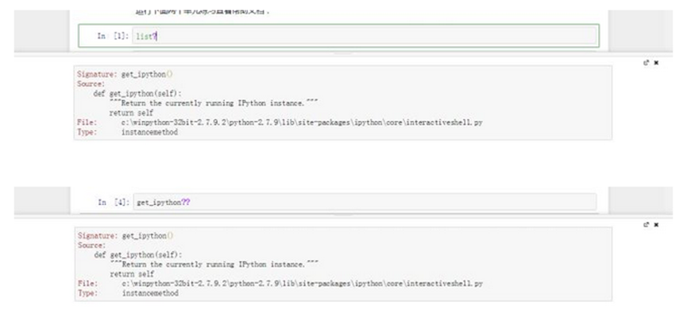

# 基本技巧
## 命令模式下的单元格操作：
如果单元格的边框为绿色（即为编辑模式），请按`ESC`键，退回到命令模式。在命令模式下被选中的单元采用灰色边框显示。按上下方向键可以移动选择框。
数字键：将单元格变为标题类型，数字越大标题越小
`L`：显示代码的行号
`m`：将单元格变为markdown类型，在markdown类型的单元格内可以编写文档
`y`：将单元格变为代码类型，在代码类型的单元格中输入Python代码
`d`：按两下d按键删除单元格.z：撤销最后删除单元格操作
`a`：在当前单元格之上创建一个新的单元格
`b`：在当前单元格之下创建一个新的单元格
`x`：剪切当前单元格
`c`：复制当前单元格
`v`：在当前单元格之下粘贴剪切板中的单元格
`shift+k`：将当前单元格上移
`shift+j`：将当前单元格下移
`shift+m`：与下面的单元合并

## 编辑和运行：
编辑模式下单元使用绿色边框显示，在命令模式时按Enter即可进入编辑模式。
`Ctrl+Enter`：结束编辑，对于代码单元将运行其中的代码，对于标题单元和markdown单元将格式化显示
`Shift+Ente`r：运行当前选择的代码单元，并自动选择下一个单元.
`Alt+Enter`：运行当前的代码并在下面插入新的单元。
`ctrl+/`：为一行或多行添加或取消注释
Notebook采用markdown对文本进行格式化标注。关于markdown的详见相关教程。
在命令模式下按`Enter`键进入编辑模式即可查看本段文字的Markdown代码。
在行内的数学公式使用单个$括起，单独占一行的数学公式使用SS括起数学公式采用LaTex格式编写，可以使用下面的在线编辑器编写LaTeX数学公式：[在线编辑TaTex](https://www.codecogs.com/latex/eqneditor.php)
## 操作运算核
如果进入了Python的死循环，可以在命令模式下按两下i按键终止循环。

注意右上角图标从空心圈变为实心圈，如上图，表示运算核正在工作，无法执行新的代码。

请按两下i按键终止循环，注意右上角的图标变回空心圈，如下图。

如果按键不能终止编译代码中的死循环，可以按两次0（是零不是欧）按键重新启动运算核心，当的运行环境中的所有对象都将消失。重新启动运算核心会有如下提示：

## 在线帮助和自动完成
Notebook支持显示函数和方法的文档和源代码，以及自动完成对象的属性。
输入代码时，按[TAB]键可以显示自动完成提示框。自动完成支持当前执行环境中已知的模块名、变量名、对象的屋性名，以及文件和目录名。如下图所示：

  

对于当前环境中已知的对象，可以在其后面添 问号查看相应的说明信息和文档，添加两个问号可以查看对象对应的源程序。按Ctrl+Enter显示如下 

调用函数时，按[shift tab]组合键可以显示函数的调用参数和说明文档，按一次组合键显示基本作息，两次显示详细信息，三次延时停留信息框，四次则将信息显示在下方的滑动窗口中。按四次的情况如下图所示：

## 向jupyter notebook导入python文件
（1）从本地导入python文件，可以直接使用%load xxx.py，比如把名字为untitledo.py的文件导入至jupyter中.注意：本地文件导入时的绝对路径和相对路径的引用方式的不同

按Ctrl+Enter后，结果如下：

再按Ctrl+Enter后，结果如下：

## jupyter中运行python文件
直接在cell中输入：%run xxx.py按Ctrl+Enter后，执行结果直接在这个cell的下面显示如下图所示：

## 图片显示
当在程序中使用了matplotlib绘图，不能直接显示时，需要加%matplotlib inline

加%matplotlib inline后的显示如下图所示：

## 参考文献：
[PYTHON科学计算（第2版）】张若愚著清华大学出版社2016-04-06
