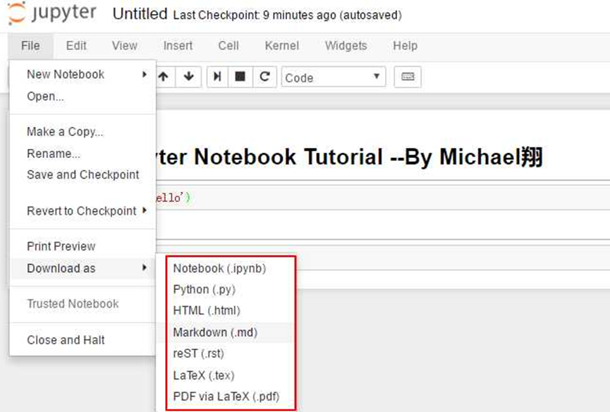
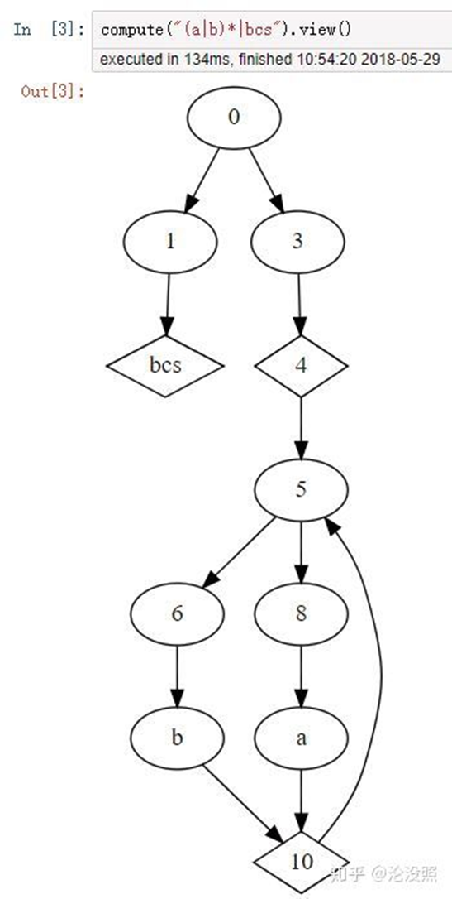

# 几个常用功能
如何优雅的使用Jupyter Notebook，简单描述一下目前我常用的几个功能吧：
## 多种格式保存
可以另存为你想要的文件格式，比如：md文件、pdf文档、py文件，当你专心做完实验后，就可以直接导出你想要的文件。


## 快捷键

在Help里边可以随时查看，常用的快捷键记住就好了，下面是我常用的几个快捷键：

`Shift+Enter` ：执行当前cell里的代码，并且在下一行插入一个cell
`A`：在当前cell的上一层添加cell
`B`：在当前cell的下一蹭添加cell
`dd`：删除当前cell
`m`：进入markdown模式，编写md的文档进行描述说明
注意：使用快捷键之前，需要按`ESC`进入命令模式。

## 分享
有时候你可能想要将自己的Jupyter Notebook文档分享给别人，甚至有些大牛直接拿着ipynb文档直接在技术大会分享，这个网站可以帮助你：[Jupyter Notebook Viewer](https://nbviewer.jupyter.org/)

## 矢量图
类似于 Matplotlab , `Graphviz` 在 Jupyter Notebook 上也能直接显示，直接是矢量图形式的：
```
from graphviz import Digraph
u = Digraph()
u.edge("1", "2", label="comment", color="blue")
u.edge("2", "2")
u.node("2", shape="doublecircle")
u
```

这个的好处是，如果一个方法返回了 u ，那么 Jupyter Notebook 能直接显示这个结果， debug 非常方便。


还可以保存成 svg, pdf, png 等
```
u = Digraph("Graph1", filename="Graph1", format="pdf")
u.node(str(1))
u.render()
# u.view()
# help(u)
```

## Jupyter Notebook Extensions

也很好用，上图中启用了两个，一个是`计时工具`，另一个是`autopep8`，可以直接格式化代码块，就是右上角像刷子一样的东西。
