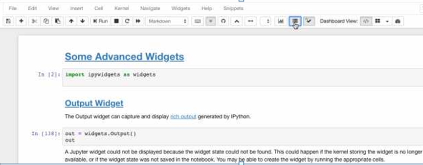
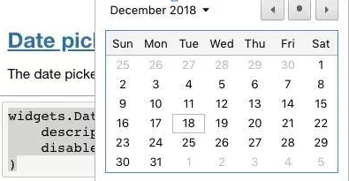

# 如何优雅地使用 Jupyter
 

除了基础的写文档之外，其实Jupyter还有N多功能，简直是一个集视频、图片、PPT、多种交互于一身的万花筒。
如果不会用，你可能错过了Jupyter 99%的功能。

Medium上走向数据科学（Towards Data Science）专栏的作者Parul Pandey就总结了七大Jupyter的进阶用法:

## 执行shell命令

Shell是一种与计算机进行文本交互的方式。
一般来讲，当你正在使用Python编译器，需要用到命令行工具的时候，要在shell和IDLE之间进行切换。
但是，如果你用的是Jupyter，就完全不用这么麻烦了，你可以直接在命令之前放一个“!”，就能执行shell命令，完全不用切换来切换去，就能在IPython里执行任何命令行。

```
In [1]: !ls
example.jpeg list tmp
In [2]: !pwd
/home/Parul/Desktop/Hello World Folder'
In [3]: !echo "Hello World"
Hello World
```
我们甚至可以将值传递给shell，像下面这样：
```
In [4]: files= !ls
In [5]: print(files)
['example.jpeg', 'list', 'tmp']
In [6]: directory = !pwd
In [7]: print(directory)
['/Users/Parul/Desktop/Hello World Folder']
In [8]: type(directory)
IPython.utils.text.SList
```

注意，返回结果的数据类型不是列表。

## 给Jupyter换主题

使用Jupyter主题，不仅能让你的Jupyter界面更好看、更舒服，还能让屏幕上的代码看起来更显眼。
比如Chesterish主题：

solarizedl主题：

来看一下具体的操作方法：

第一步，安装：

```
pip install jupyterthemes
```

第二步，加载可用主题列表：
```
jt -l
```
第三步，选择你想要的主题：
```
# selecting a particular theme
jt -t <name of the theme>
# reverting to original Theme
jt -r
```
现在可用的主题有：
```
chesterish
grade3
gruvboxd
gruvboxl monokai
oceans16
onedork
solarizedd
solarizedl
```
把名字填进去就好啦。
不过，每次换主题的时候都要重新加载Jupyter，才能看到主题变化。
另外我们上面讲的在命令之前加“!”也一样可用。

## Notepad扩展

笔记本扩展（nbextensions）是一种JavaScript模块，可以加载到笔记本前端页面上，可以大大提升用户体验。
比如下面这些扩展工具，简直能让效率提升10000倍。

### Hinterland

Hinterland功能可以让你每敲完一个键，就出现下拉菜单，可以直接选中你需要的词汇。


### Snippets
Snippets在工具栏里加了一个下拉菜单，可以非常方便的直接插入代码段，完全不用手动敲。

### 拆分单元格
拆分笔记本中的单元格，改成相邻的模式，看起来就像分了两栏。

### 目录
这个功能可以自动找到所有的标题，生成目录。
并且这个目录还是移动的呦，你可以放在侧边栏，也可以拖动到任何你喜欢的地方悬浮起来。

### 折叠一个标题下的全部内容
如果你的代码太长，觉得滚动过去太麻烦，可以直接折叠掉。

### Autopep8
一键美化代码，强迫症的福音。

#### 安装方法
最后看一下怎么装，需要用到conda：
```
conda install -c conda-forge jupyter_nbextensions_configurator
```
或者用pip：
```
pip install jupyter_contrib_nbextensions && jupyter contrib nbextension install
incase you get permission errors on MacOS,
pip install jupyter_contrib_nbextensions && jupyter contrib nbextension install --user
```
然后把Jupyter打开，你就可以看到`NBextensions`这个选项卡了。

找不到的话就去菜单的Edit里面找。

搞定。
## Jupyter小工具
还有一些Jupyter小工具，比如滑块、文本框之类的部分，可以做一些方便的交互。
### 滑块
 

```
def f(x):
 return x
# Generate a slider 
interact(f, x=10,);
```
### 布尔值生成复选框


```
interact(f, x=True);
```
### 字符串生成文本区域


```
# Strings generate text areas
interact(f, x='Hi there!');
```
### 播放器

 
```
 play = widgets.Play(
  # interval=10,
  value=50,
 min=0,
 max=100,
 step=1,
 description="Press play",
 disabled=False
)
slider = widgets.IntSlider()
widgets.jslink((play, 'value'), (slider, 'value'))
widgets.HBox([play, slider])
```
### 日历


 
```
widgets.DatePicker(
 description='Pick a Date',
 disabled=False
)
```
不过这个部件只能Chrome和Edge里用，Firefox和Safari不支持。
### 调色盘


```
widgets.ColorPicker(
 concise=False,
 description='Pick a color',
 value='blue',
 disabled=False
)
```
### 标签


```
tab_contents = ['P0', 'P1', 'P2', 'P3', 'P4']
children = [widgets.Text(description=name) for name in tab_contents]
tab = widgets.Tab()
tab.children = children
for i in range(len(children)):
 tab.set_title(i, str(i))
tab
```
其他的小部件，可以在文末的传送门跳转到GitHub寻找。
### 安装方法
```
# pip
pip install ipywidgets
jupyter nbextension enable --py widgetsnbextension
# Conda
conda install -c conda-forge ipywidgets
```
#Installing ipywidgets with conda automatically enables the extension
使用“interact”功能自动创建UI控件，这是使用IPython最方便的方法。
```
# Start with some imports!
from ipywidgets import interact
import ipywidgets as widgets
```
### Qgrid
Qgrid也是一个Jupyter的小部件，不过它主要用于数据帧，装上之后，就可以像操作Excel里的筛选功能一样，方便的处理数据。


### 安装方法
#### 用pip安装：
```
pip install qgrid
jupyter nbextension enable --py --sys-prefix qgrid
# only required if you have not enabled the ipywidgets nbextension yet
jupyter nbextension enable --py --sys-prefix widgetsnbextension
```
#### 用conda安装：
```
# only required if you have not added conda-forge to your channels yet
conda config --add channels conda-forge
conda install qgrid
```
## 放PPT
人在江湖飘，难免遇到要做PPT的时候。
但是，如果你的内容都已经放在Jupyter里了，再重新导入PPT，太麻烦了，我们自动转换吧。
一种方法是用Jupyter内置的PPT选项，依次点击菜单栏里的`View → Cell Toolbar → Slideshow`，之后每个单元格上面都会有一个灰色的横条，选`Sub-Slide`。
 
 
然后输入以下代码：
```
jupyter nbconvert *.ipynb --to slides --post serve
# insert your notebook name instead of *.ipynb
```
好了，现在就变成PPT样式的了，显示在端口8000，你也可以查看源代码找到PPT文件。

你也可以提前换好主题，比如onedork主题，然后再转换成PPT的的时候就是同一个主题风格的PPT了。

不过，用PyTorch默认方法生成的PPT代码不能编辑，这个时候就要用到RISE插件了。
RISE用到reveal.js来运行PPT，可以不退出PPT，直接运行代码。

先来安装RISE，推荐用conda：
```
conda install -c damianavila82 rise
```
其实不太推荐pip：
```
pip install RISE
```
然后调用JS和CSS：
```
jupyter-nbextension install rise --py --sys-prefix
#enable the nbextension:
jupyter-nbextension enable rise --py --sys-prefix
```
安装好啦，现在重新打开你的Jupyter Notebook，发现一个新的扩展，名叫“`Enter/Exit RISE Slideshow`”。

戳一下，一个可以边演示边改的PPT就好了。

## 嵌入链接和pdf
扔链接再跳转实在是太麻烦了，不如直接把素材放进Jupyter里面。
### 嵌入链接
```
#Note that http urls will not be displayed. Only https are allowed inside the Iframe
from IPython.display import IFrame
IFrame('https://en.wikipedia.org/wiki/HTTPS', width=800, height=450)
```
操作方式如下，当然你需要把链接换成你要放的链接：

### 嵌入pdf
```
from IPython.display import IFrame
IFrame('https://arxiv.org/pdf/1406.2661.pdf', width=800, height=450)
```
同样，把pdf链接换成你需要用的pdf。

## 参考文献

### 原文：Bringing the best out of Jupyter Notebooks for Data Science
Parul Pandey, Towards Data Science
https://towardsdatascience.com/bringing-the-best-out-of-jupyter-notebooks-for-data-science-f0871519ca29
### Jupyter主题
https://github.com/dunovank/jupyter-themes
### IPython小部件
https://github.com/jupyter-widgets/ipywidgets
