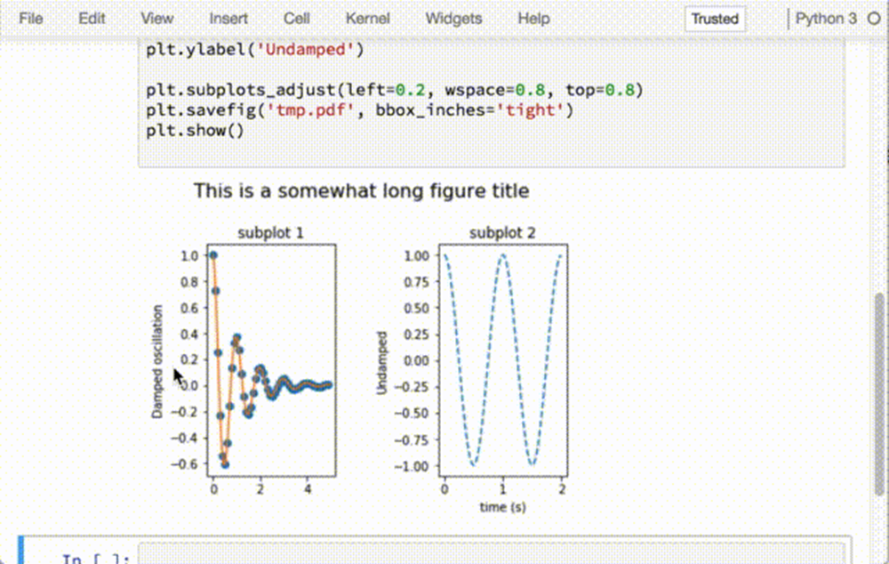

# Jupyter Notebook 输出矢量图

相信大家都很熟悉在 Jupyter Notebook 上面用 Matplotlib 了，但是不知道大家看到画出来那一坨糊糊的东西会不会跟我一样浑身难受。实际上，只要多加一行配置，就能够让 Matplotlib 在 Jupyter Notebook 上面输出矢量图了：

```
import matplotlib
import matplotlib.pyplot as plt
%matplotlib inline
%config InlineBackend.figure_format = 'svg'
```
上面的最后一行指定了输出的格式是 svg，这样浏览器就能为你渲染矢量图了。下面上两张比较图：
 
 
 
