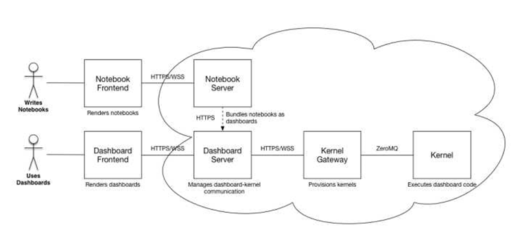

# Jupyter 另类套装，非常实用
jupyter/dashboards +dashboards_bundlers +dashboards_server +kernel_gateway +dashboards_setup 


## 概述

今天看到一个非常好的功能 Jupyter DashBoards
基于Jupyter的仪表盘，非常Nice的功能，可以实现定制化，可视化与代码的分离
然后在这个基础上依次修正以及补充，基于Jupyter的一些误区和知识
本机的环境是 py3jupyter
感觉今天最大的收货是对学会看 docker 的配置文件 + 学会查找 github issue
## 插件-nb extensions
Git项目地址是，nbextensions 以及 nbextensions_configurator。前者是各类型有用的插件，后者是能够直接在Jupyter 上图形话调节界面的功能。
这里今天得到的收获主要是基于虚拟环境的一个配置问题
在官网上，安装完 nbextensions 之后，本质是将一
大堆插件放在下面目录下
```
/Users/{user}/Library/Jupyter/extensions
```
接下来进行插件激活和路径指定，官网上的提示使用的是
```
jupyter contrib nbextension install --user
```
如果这么操作的话，是在用户目录 例如 `/home/user/.jupyter `下面生成 nbextensions 的配置, 这会导致环境不隔离的情况。
正确的做法，切换到新的环境下的jupyter，执行
```
jupyter contrib nbextension install --sys-prefix
```
这样就做到只影响该环境下的Jupyter，在某环境下的 `/etc/jupyter` 文件夹下产生对应的配置文件，nb的 和 notebook的都有，如果对于 notebook的配置有特殊的配置，可以写在这里，例如密码，token等。
如果要删除该内容，install 替换为` uninstall`。
如果因为选择的是 users 会导致的问题是 no module named nbextensions，某些和root 环境不一致的环境找不到配置文件
### jupynter 版本的问题
2017年06月04日，jupyter notebook 的版本已经升级到了5.0，但是通过 pip 安装的 nbextensions 的插件所写的代码，是4.x的程序，这个通过找 github issues, 发现作者已经在 master 分支上做了修改，nbextensions.py 这个文件，修改如下代码即可
```
try:
    # notebook > 4.2
    from notebook.nbextensions import _get_nbextension_dir as get_nbext_dir
except:
    # notebook <= 4.2
    from notebook.nbextensions import _get_nbext_dir as get_nbext_dir
```
## Jupyter DashBoard
### 代码组成
这是一个非常另类的套装, 由以下几个部分组成
jupyter/dashboards， notebook 插件将代码转化为可定制的 dashboard
dashboards_bundlers，notebook 插件将定制好的dashboard 输出到 server端
dashboards_server，nodejs web框架，主要作用是与juypter server 通信展示只读功能的dashboard
kernel_gateway，一个中间的类似于代理的web框架，用于和dashboard server 通信
dashboards_setup ，一套基于docker的服务范例，讲解各个服务如何配置
架构流程如下图：

整完这一套，模型开发人员，两行代码就一套定制化的BI系统。这套系统搭建的时候最难的地方是连接
### dashboard 连接

#### Jupyter Notebook

这个是一端，启动的时候需要配置一下启动token和Server 的端口，方便和另一端加密验证。

```
# token 的配置写在了配置文件里
# 端口设置在环境变量中
jupyter notebook
```
#### Dashboard Server
用于HTML展示。有两个主要输入，一个是token作为加密验证的功能，一个是 gateway的地址 http://host:port 即可

```
# 和 kernal 指定的ip 一致
# token 设置在了环境变量里
jupyter-dashboards-server --KERNEL_GATEWAY_URL=http://{kernal}:8888
```
#### kernal gateway
这个是在 dashboard_server 和 jupyter server 之间的一道桥梁。它和jupyter server的连接方式比较神奇，应该是通过jupyter 内核来通信，也就是 二者需要在同一台机器上即可。
但是最合理的方式是，kernal gateway 和 jupyter 在同一目录下，统一端口上启动，否则将会有一些模板加载等小错，这里更神奇的是同一端口。
```
jupyter kernelgateway --KernelGatewayApp.ip=0.0.0.0
```
#### 环境变量
除了命令行直接传进去的配置，为了保持独立性，还需要在环境变量中增加两项的设置

```
export DASHBOARD_SERVER_URL=http://{dash_server_host}:3000
export KG_AUTH_TOKEN='xxxxxxxxxxxxxxxxxxxx' # 与Jupyter Notebook 的验证Token保持一致
```
### 环境隔离

在安装这些工具的时候，他们很多是 nbextension，所以启用的时候注意环境的隔离
例如 dashboard的启动方式 `jupyter dashboards quick-setup --sys-prefix`
这样就做到与环境隔离了
### Docker当文档

按照 dashboards_setup的教程，在本地拉了三个镜像服务，然后启动，结果耗时两小时，发现可以跑成功
看是看懂了MakeFile的意义，我直接去看了这三个镜像分别干了什么，notebook 和 dserver 都和我想的一样
后来发现困扰我最久的kernal的启动方式，真实跪了总体配置

```
kernel_gateway:
   build:
     context: .
     dockerfile: Dockerfile.kernel
     args:
       # pip versioning by default
       # Replace with local tarballs like /src/jupyter_declarativewidgets-someversion.tar.gz
       DECLWIDGETS_PKG: 'jupyter_declarativewidgets==0.7.*'
       IPYWIDGETS_PKG: 'ipywidgets==5.1.*'
   volumes_from:
     - notebook
   environment:
     KG_ALLOW_ORIGIN: '*'
```
得出的结论是 和 notebook 共享启动地址
在看具体配置

```
# run kernel gateway, not notebook server
CMD ["jupyter", "kernelgateway", "--KernelGatewayApp.ip=0.0.0.0"]
```
得出的结论是用默认端口号，共享端口
之后我再本地按照这种方式启动了，kernal 直接成功
这件事情让我得到了很大的启示，docker 真的很强大，这是最清楚的文档，能让机器看懂的文档，人更能看懂