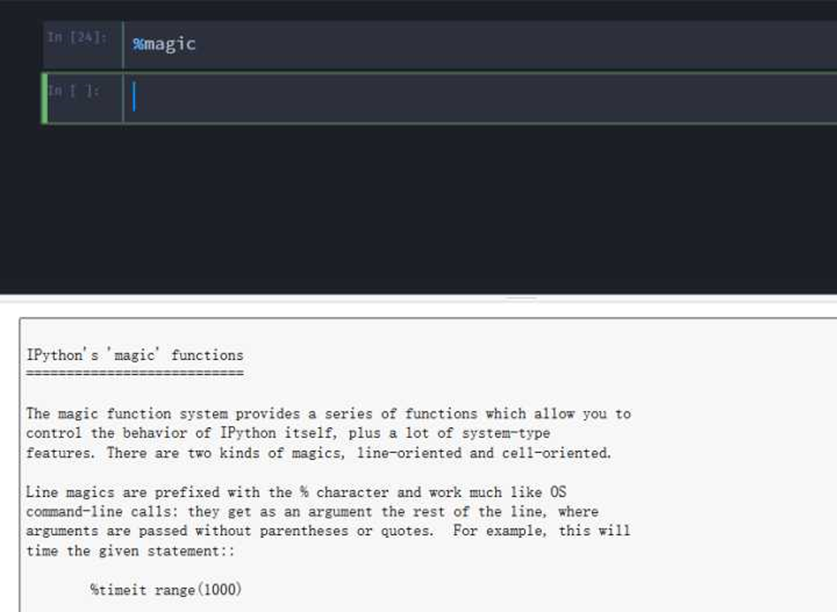

# magic命令
我就补充一点magic命令吧！在Jupyter中可以使用许多魔法命令，因此在Jupyter环境中的操作可以更加得心应手
。魔法命令都以%或者%%开头，以%开头的成为行命令，%%开头的称为单元命令。
行命令只对命令所在的行有效，而单元命令则必须出现在单元的第一行，对整个单元的代码进行处理。

在Jupyter中执行`%lsmagic`可以列举所有的魔法命令；

%magic可以查看关于各个命令的说明，而在%命令之后添加?可以查看该命令的详细说明。相信你会爱上Jupyter的

 
